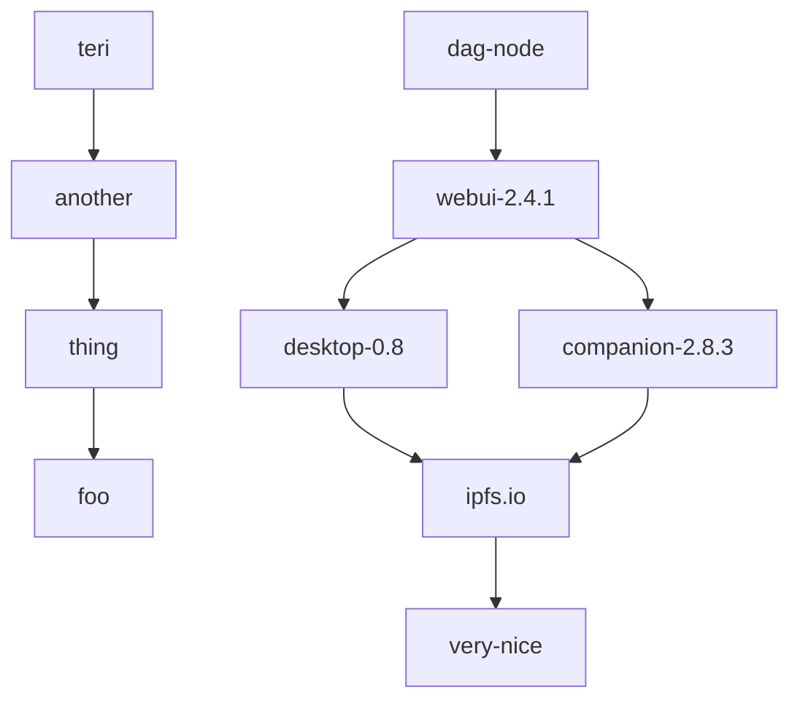

# GUI and In Web Browsers - Weekly Sync Call

# 2019-05-15: 📦 npm-on-ipfs

:::info
- **Date:** **2019-05-15**, 16:00 PM (UTC)
- **Recording:** https://www.youtube.com/watch?v=4Ky-MzcjGXg
- **Notes:** https://hackmd.io/QaxiCU8BQqOuK8B8Tdi36g?view#2019-05-15-%F0%9F%93%A6-npm-on-ipfs
- **Host:** olizilla
- **Notetaker:** jimpick
- **Participants:**
  - achingbrain
  - olizilla
  - lidel
  - victorb
  - jimpick
  - fsdiogo
- **Be prepared**
  - Try out npm-on-ipfs locally
:::

## 📦 npm-on-ipfs - where we're at & what's next.
> [name=achingbrain]

* achingbrain
   - npm-on-ipfs is a mirror of the public registry that adds CIDs to the "packuments"
   - client side component runs a local web server
   - describes how it works
 * olizilla
   - we are running a centralized service for the registry service
   - to achingbrain, "where's your head at?"
 * achingbrain
   - bug in unixfs exporter in js-ipfs - got fixed, async/await refactoring
   - next week:
     - new packages announced on pubsub, but no signatures, could be poisoned
     - npm client will validate tarballs
     - worst case, fallbacks to public registry
   - we are only mirroring a centralized service
   - protocol handler? ipfs://... or ipns://...
   - publish own packuments on IPNS
   - idea: search engine for packages published via IPNS or github
   - problem: IPNS is slow ... quick in future?
 * victorb
   - multiformat for packages in different registries?
   - openregistry
     - part of a bigger effort to create open infrastructure
       - "open services"
       - funded by community
     - openregistry vs. npm-on-ipfs
       - not developed by private company
       - expenses/income public, everything public
       - lazy registry
       - bolivar, written in go, is the client
  * olizilla
    - overlap between projects
    - feedback helps to direct performance improvements in IPFS
  * victorb
    - bolivar is faster than downloading from npm
  * olizilla
    - ipfs-on-npm in ipfs-desktop being released in a little while
    - didn't realize how similar openregistry was with npm-on-ipfs
  * victorb
    - openregistry is intended to be a universal registry
  * olizilla
    - ability to co-host things that i depend on
    - how to represent to the users what they are doing?
  * achingbrain
    - offline, no left-pad
    - github has automated blocking on vulnerabilites
  * jimpick
    - people may want to mirror to provide sustainability
  * jessica
    - showing chatty output on terminal is good if performance is bad
    - interesting to see if change npm default ... will people notice?
  * olizilla
    - ok if there's a big opt-in switch in the UI?
  * chriswaring
    - what about switching node versions?
  * olizilla
    - vote on overriding npm? 50/50 result
    - feature in UI for opting in to experiments
    - Q: Does desktop have a CLI? A: next version will introduce ipfs cli
    - Q: Does it work with yarn? A: yes, you get ipfs-npm and ipfs-yarn
    - Q: Does integration install ipfs-npm via npm? A: That was the plan.
    - Bootstrapping issue
  * chriswaring
    - Might not be able to answer "why?" on first attempt
  * achingbrain
    - Distributed identity coming to help solve

## 🚀 What needs to be done to release ipfs-npm with ipfs-desktop
> [name=olizilla]

### Focus

- is this an experiment to stress test ipfs or a service we intend to support?

### Speed

- Clean install of `iim` takes ~10s via `npm` & ~40s via `ipfs-npm`
  - https://github.com/ipfs-shipyard/npm-on-ipfs/pull/103
- Subsequent install should be faster?
- Can the LAN install be as fast as an optimised http install?
- Perf issue: https://github.com/ipfs-shipyard/npm-on-ipfs/issues/65

### Infra

- registry stability https://github.com/ipfs-shipyard/npm-on-ipfs/issues/90
- blocked on infra team time

### Useful co-hosting

- How do we indicate that you are sharing things you download back to the network
- No bandwidth stats per CID, can we workaround that?
- Under what secanrios does it work?
  - have we tested LAN only installs?

### UX CLI

- Quiter installs AKA: what should the CLI say
- Don't invoke IPFS for local commands like `npm ls`
  - https://github.com/ipfs-shipyard/npm-on-ipfs/issues/95
- Do invoke IPFS for `npx` 
  - https://github.com/ipfs-shipyard/npm-on-ipfs/issues/96

### Integration with Desktop UI

- Should it alias `npm` to `ipfs-npm` when enabled?
- fsdiogo
  - add a tab where the user can view installed packages
  - be able to browse, install and remove packages
  - may be a bit of a stretch, but have a visualization with the history of the installed/removed packages

## 🎤 Open mic
> Share progress, raise concerns, and anything you'd like to talk about.

### Open Registry

https://open-registry.dev/
> A (JavaScript) Package Registry funded, developed and maintained by the community, for the community

- https://github.com/open-services/open-services
- https://github.com/open-services/bolivar - P2P proxy for Open-Registry
- https://github.com/open-services/public-registry-benchmarks

### olizilla: hackmd.io is very nice.

oh my! mermaid diagrams!
> [name=Oli Evans] hello

- see: https://mermaidjs.github.io/
- https://hackmd.io/features

### alanshaw: ipfs dag visualiser is very nice

https://ipfs.io/ipfs/QmYGNCcD2sFPzA8UQAmxvRYbjJJDXamvkbLgRakCrc3EAQ/

### Ideas for next weeks call

- Protoschool plans and ipfs camp content?
- rethink ipfs desktop / webui as developer tool
- What is left to do for Brave integration?
- _your suggesions please_

## Actions
> Review last weeks actions. Add things that come up in this weeks discussion.

- [ ] **olizilla** - Set next weeks call agenda
- [x] **notetaker** - Upload recording to youtube
- [ ] **notetaker** - Copy notes to [team-mgmt repo](https://github.com/ipfs/pm/tree/master/meeting-notes)

## Team updates

### Any Blockers?

- **@lidel**: not a hard blocker, but would be cool to land this
  - js-ipfs gateway needs to load files/dirs from hamt shards  [js-ipfs-http-response/pull/19](https://github.com/ipfs/js-ipfs-http-response/pull/19)
- ?

### @lidel

- Done:
  - Releases
    - ipfs-companion [v2.8.2](https://github.com/ipfs-shipyard/ipfs-companion/releases/tag/v2.8.2)  (Stable)
      Includes Prototype of Embedded HTTP Gateway in Brave ([#719](https://github.com/ipfs-shipyard/ipfs-companion/pull/719))
      (opening `/ipns/tr.wikipedia-on-ipfs.org/wiki/Mars.html` works) 
    - is-ipfs  [v0.6.1](https://github.com/ipfs/is-ipfs/releases/tag/v0.6.1)
    - chrome-net [v3.2.2](https://github.com/feross/chrome-net/pull/38)
  - Rebased `/ipns/` gateway support: [js-ipfs/pull/2020](https://github.com/ipfs/js-ipfs/pull/2020)
    (parked until remaining  IPNS PRs land)
  - IPFS Camp
      - Check-ins with folks from Brave
      - WIP materials for Course C
          - course outline draft
          - prototyping Peer Dashboard for workshop part
  - IPNS
      - Adding new multicodec to represent libp2p keys as CIDv1:
        [multicodec/issues/130](https://github.com/multiformats/multicodec/issues/130)
  - Read into Anti-tracking Threat Model for WebPackage/SXG: 
    [WICG/webpackage/pull/424](https://github.com/WICG/webpackage/pull/424/files)
    [WICG/webpackage/issues/433](https://github.com/WICG/webpackage/issues/433)
  - PSA: WebRTC WG at W3C looking for DHT/P2P use cases:
    [libp2p-webrtc-star/issues/177](https://github.com/libp2p/js-libp2p-webrtc-star/issues/177)
- Next:
    - IPFS Camp
    - Companion/Brave

### @ericronne
- Done:
  - Week of tending to ailing relative :/
  - Proposed changes to desktop/webui [Files page](https://github.com/ipfs/ipfs-gui/issues/79)
  - Updated this meeting's calendar entry notes link to point to this doc
- Next: 
  - "Experiments" opt in design
  - Release an alpha component lib with the help of @cwaring (or @fsdiogo?), using bit.dev

### @olizilla
- Done:
  - IPFS Office hours - https://github.com/ipfs/community/issues/411
  - agenda, content and this new doc format for GUI & In web browsers weekly call
  - test to compare first install speed for ipfs-npm
    - https://github.com/ipfs-shipyard/npm-on-ipfs/pull/103
  - IPFS DAG visualiser improvements with @alanshaw
    - https://ipfs.io/ipfs/QmYGNCcD2sFPzA8UQAmxvRYbjJJDXamvkbLgRakCrc3EAQ/
  - 1:1s
- Next:
  - Draft an npm-on-ipfs release with ipfs-desktop plan
  - PRs to`ipfs-npm` improve logging and see if we can find a faster pattern
  - visualisation for ipfs data life-cycle

### @fsdiogo
- Done:
    - Paired with Teri to fix the MFS Lesson 7 validation
        - https://github.com/ProtoSchool/protoschool.github.io/pull/200
    - Added markdown support to success and fail messages
        - https://github.com/ProtoSchool/protoschool.github.io/pull/223
    - Replaced play button with another SVG
        - https://github.com/ProtoSchool/protoschool.github.io/pull/224
    - Released Web UI v2.4.5
        - https://github.com/ipfs-shipyard/ipfs-webui/releases/tag/v2.4.5
    - Reposition `Useful concepts` box
        - https://github.com/ProtoSchool/protoschool.github.io/pull/225
    - `Resources/Next Steps` final lesson in tutorials
